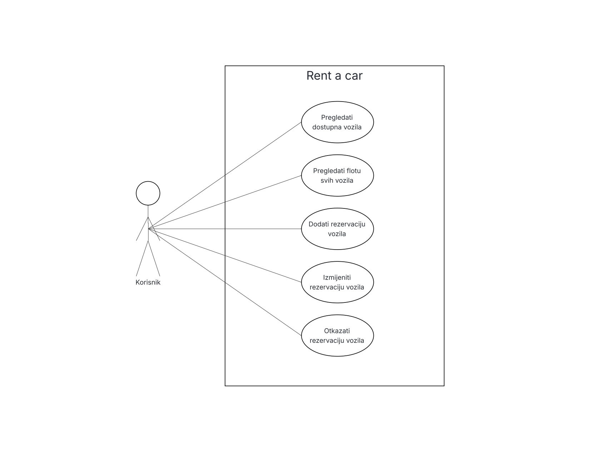

## Klasa: Vozilo

**Entiteti:**
id (primarni ključ) (tip: integer)
broj_sasije (string, UNIQUE)
marka (tip: string)
model (tip: string)
tip (tip: string) – npr. osobno, dostavno, hatchback, SUV, itd.
godiste (tip: integer) – godina proizvodnje vozila
boja (tip: string) – boja vozila
tip_goriva (tip: string) – npr. benzin, dizel, električno
cijena_dnevnog_najma (tip: decimal) – cijena najma vozila po danu

## Klasa: Termin_najma

**Entiteti:**
id (primarni ključ) (tip: integer)
vozilo_id (strani ključ) (tip: integer)
datum_od (datetime) - pocetni datum
datum_do (datetime) - krajnji datum
status (tip: string) – npr. rezerviran, u tijeku, otkazan
ukupna_cijena_najma (tip: decimal) – ukupna cijena najma izračunata na temelju cijene dnevnog najma vozila i trajanja najma

## Use case dijagam
